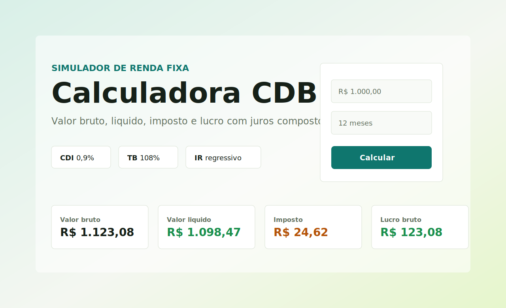

# CDB Calculator

Aplicacao full stack para calculo de investimento CDB, composta por API ASP.NET Core em .NET 10 e frontend Angular standalone. A solucao foi organizada para demonstrar Clean Architecture, SOLID, baixo acoplamento, testes automatizados, logs estruturados, validacao centralizada e uma experiencia de usuario responsiva.



## Arquitetura

O backend segue Clean Architecture:

```text
backend/
|-- CdbCalculator.Api              # Controllers, middleware, CORS, Swagger, versionamento
|-- CdbCalculator.Application      # DTOs, validators, contratos e services
|-- CdbCalculator.Domain           # Entidades, regras de negocio, politica de IR e calculadora
|-- CdbCalculator.Infrastructure   # Composicao de dependencias externas
`-- CdbCalculator.Tests            # Testes unitarios e de integracao
```

O frontend segue uma estrutura por feature:

```text
frontend/src/app/
|-- core/
|-- shared/
`-- features/cdb-calculator/
    |-- components/
    |-- models/
    |-- pages/
    `-- services/
```

## Tecnologias

- Backend: .NET 10, ASP.NET Core Web API, FluentValidation, Serilog, Swagger/OpenAPI, API Versioning.
- Testes backend: xUnit, FluentAssertions, Moq, Microsoft.AspNetCore.Mvc.Testing, Coverlet.
- Frontend: Angular 20, Standalone Components, Reactive Forms, Angular Material, RxJS.
- Testes frontend: Jasmine, Karma, Edge/Chrome headless.
- Qualidade: EditorConfig, Prettier, ESLint, nullable enabled, warnings como erro no backend.

## Regras De Negocio

- Valor inicial deve ser positivo.
- Prazo deve ser maior que 1 mes.
- Rendimento mensal: `VF = VI * (1 + (0.009 * 1.08))^n`.
- Imposto aplicado somente sobre o lucro.
- Tabela de IR: ate 6 meses `22.5%`, ate 12 meses `20%`, ate 24 meses `17.5%`, acima de 24 meses `15%`.
- Valores monetarios retornam arredondados para 2 casas decimais.

## Como Rodar

Backend:

```bash
dotnet restore backend/CdbCalculator.slnx
dotnet run --project backend/CdbCalculator.Api/CdbCalculator.Api.csproj --launch-profile https
```

Swagger:

```text
https://localhost:7081/swagger
```

Frontend:

```bash
cd frontend
npm install
npm start
```

Aplicacao:

```text
http://localhost:4200
```

## Testes E Cobertura

Backend:

```bash
dotnet test backend/CdbCalculator.slnx --collect:"XPlat Code Coverage"
```

Frontend:

```bash
cd frontend
npm test
```

Builds:

```bash
dotnet build backend/CdbCalculator.slnx --no-restore -v m
cd frontend && npm run build
```

## Exemplo De Request

```http
POST https://localhost:7081/api/v1/cdb-calculator/calculate
Content-Type: application/json

{
  "initialAmount": 1000,
  "months": 12
}
```

Resposta:

```json
{
  "grossAmount": 1123.08,
  "netAmount": 1098.47,
  "taxAmount": 24.62,
  "grossProfit": 123.08
}
```

## Decisoes Tecnicas

- Controller permanece enxuto e delega o caso de uso para `ICdbInvestmentService`.
- Regras financeiras ficam no dominio, em `CdbInvestmentCalculator` e `RegressiveIncomeTaxRatePolicy`.
- Taxas de CDI e banco ficam em configuracao centralizada (`CdbCalculatorSettings`).
- FluentValidation roda no pipeline via action filter, antes da regra de negocio.
- Middleware global padroniza erros como `ProblemDetails`.
- Serilog registra requisicoes e excecoes com logs estruturados.
- Frontend usa service isolado para HTTP, componentes pequenos e formulario reativo validavel.

## Variaveis E Configuracao

As configuracoes principais ficam em `backend/CdbCalculator.Api/appsettings.json`:

```json
{
  "CdbCalculator": {
    "Cdi": 0.009,
    "BankRate": 1.08
  },
  "Cors": {
    "AllowedOrigins": ["http://localhost:4200"]
  }
}
```
